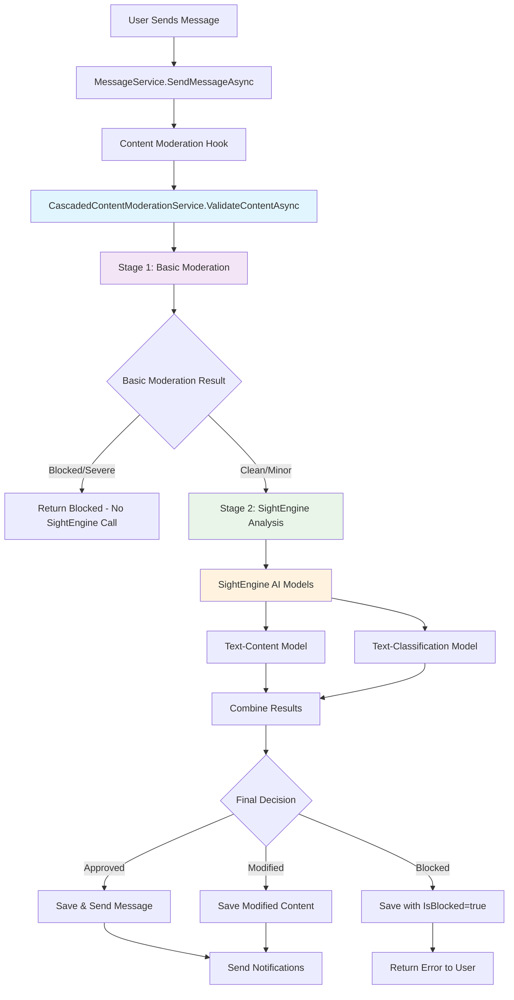

# Messaging System Moderation Workflow

**Version:** 2.0  
**Last Updated:** January 2025  
**Author:** System Documentation

---

## Overview

This document describes the comprehensive **two-stage cascaded messaging moderation workflow** implemented in the NeighborTools platform. The system combines basic regex-based validation with advanced AI-powered content analysis through SightEngine API integration. It covers automated content scanning hooks, manual review processes, administrative interfaces, and escalation procedures.

## Table of Contents

1. [System Architecture](#system-architecture)
2. [Automated Content Moderation](#automated-content-moderation)
3. [Message Processing Pipeline](#message-processing-pipeline)
4. [Content Scanning Implementation](#content-scanning-implementation)
5. [Administrative Interface](#administrative-interface)
6. [Manual Review Workflow](#manual-review-workflow)
7. [User Actions and Enforcement](#user-actions-and-enforcement)
8. [API Endpoints](#api-endpoints)
9. [Configuration and Maintenance](#configuration-and-maintenance)
10. [Troubleshooting](#troubleshooting)

---

## System Architecture

### Core Components - Cascaded Moderation Architecture



### Key Services

1. **IMessageService** (`MessageService.cs`)
   - Primary message handling service
   - Contains the "before dispatch" hook at lines 62-68
   - Integrates with cascaded content moderation service
   - Provides admin statistics and moderated message retrieval

2. **CascadedContentModerationService** (`CascadedContentModerationService.cs`)
   - **Two-stage moderation orchestrator** - Primary moderation service
   - Combines basic regex validation with SightEngine AI analysis
   - Cost-optimization: Filters obvious violations locally before calling SightEngine API
   - Fallback handling: Returns to basic moderation if SightEngine unavailable
   - Supports image, video, text, and workflow-based moderation

3. **ContentModerationService** (`ContentModerationService.cs`)
   - **Stage 1: Basic moderation** - Regex pattern matching for prohibited content
   - User moderation history tracking
   - Local violation detection for cost optimization
   - Moderation statistics aggregation

4. **SightEngineService** (`SightEngineService.cs`)
   - **Stage 2: AI-powered analysis** - Advanced content analysis using SightEngine API
   - **Text-Content Model**: Rule-based detection (PII, links, spam, extremism, drugs)
   - **Text-Classification Model**: ML-based detection (sexual, discriminatory, insulting, violent, toxic, self-harm)
   - **Multi-media Support**: Image, video, and workflow-based moderation
   - **Confidence Scoring**: Provides confidence levels for all detections

3. **AdminController** (Backend)
   - Complete admin messaging endpoints (`/api/admin/messaging/*`)
   - Message statistics, search, moderation actions
   - Integration with admin dashboard

4. **MessagingManagement.razor** (Frontend)
   - Administrative interface for message oversight
   - Moderated message review and management
   - Analytics and reporting dashboard

5. **AdminDashboard.razor** (Frontend)
   - Messaging system overview integration
   - Real-time statistics and critical alerts
   - Navigation to full messaging management

---

## Cascaded Content Moderation Architecture

### Two-Stage Processing Pipeline

The NeighborTools messaging system implements a **sophisticated two-stage cascaded moderation approach** that optimizes for both cost-effectiveness and accuracy:

#### Stage 1: Basic Moderation (Always Runs)
- **Service**: `ContentModerationService.cs`
- **Purpose**: Filter obvious violations locally to reduce API costs
- **Method**: Regex pattern matching against prohibited content patterns
- **Cost**: Free (local processing)
- **Speed**: ~1ms processing time
- **Decision**: If content fails basic validation with Severe/Critical severity → BLOCK immediately (no SightEngine call)

#### Stage 2: SightEngine AI Analysis (Conditional)
- **Service**: `SightEngineService.cs` 
- **Trigger**: Only runs if content passes Stage 1 basic validation
- **Purpose**: Advanced AI-powered content analysis with high accuracy
- **Models Used**: 
  - `text-content` (rule-based comprehensive detection)
  - `text-classification` (ML-based sentiment and toxicity analysis)
- **Cost**: Per-API-call pricing
- **Speed**: ~200-500ms processing time
- **Accuracy**: High confidence scoring with detailed violation categorization

#### Cost Optimization Strategy
```
High-volume messages → Stage 1 filters ~80% → Only ~20% reach Stage 2 → 80% cost savings
```

#### Fallback Handling
- **SightEngine Unavailable**: Gracefully falls back to basic moderation only
- **SightEngine Errors**: Returns basic result with error logging
- **SightEngine Timeout**: Configurable timeout with fallback to basic result
- **Configuration**: `AllowImagesWhenSightEngineUnavailable` and `AllowVideosWhenSightEngineUnavailable` settings

### Configuration Architecture

#### CascadedModerationConfiguration
```json
{
  "CascadedModeration": {
    "SightEngineThreshold": "Severe",
    "AllowImagesWhenSightEngineUnavailable": false,
    "AllowVideosWhenSightEngineUnavailable": false,
    "SightEngineModels": ["text-content", "text-classification"],
    "EnableCascadedModeration": true,
    "SightEngineTimeoutSeconds": 10
  }
}
```

#### SightEngineConfiguration
```json
{
  "SightEngine": {
    "ApiUser": "your-api-user",
    "ApiSecret": "your-api-secret",
    "BaseUrl": "https://api.sightengine.com/1.0",
    "TimeoutSeconds": 30,
    "EnableLogging": true,
    "Models": {
      "Text": ["text-content", "text-classification"],
      "Image": ["nudity-2.0", "wad", "offensive", "faces"],
      "Video": ["nudity-2.0", "wad", "offensive"]
    },
    "Thresholds": {
      "SexualThreshold": 0.5,
      "DiscriminatoryThreshold": 0.4,
      "ViolentThreshold": 0.3,
      "ToxicThreshold": 0.5,
      "SelfHarmThreshold": 0.3
    }
  }
}
```

---

## Automated Content Moderation

### The "Before Dispatch" Hook

**Location:** `MessageService.cs` lines 62-142

```csharp
// Cascaded Content Moderation (Two-Stage Process)
var moderationResult = await _contentModerationService.ValidateContentAsync(command.Content, command.SenderId);

// Enhanced logging for cascaded results
if (moderationResult.Provider?.Contains("Cascaded") == true)
{
    _logger.LogInformation("Cascaded moderation completed. Provider: {Provider}, Processing time: {ProcessingTime}ms, Confidence: {Confidence}",
        moderationResult.Provider, 
        JsonSerializer.Deserialize<Dictionary<string, object>>(moderationResult.RawResponseJson ?? "{}")?.GetValueOrDefault("processing_time_ms"),
        moderationResult.ConfidenceScore);
}

// Determine if message should be blocked (Severe/Critical violations)
bool isBlocked = !moderationResult.IsApproved && moderationResult.Severity >= ModerationSeverity.Severe;

// Create message (ALWAYS save to database for audit trail)
var message = new Message
{
    // ... properties
    IsBlocked = isBlocked,
    Content = isBlocked ? command.Content : (moderationResult.ModifiedContent ?? command.Content),
    OriginalContent = moderationResult.ModifiedContent != null ? command.Content : null,
    IsModerated = !moderationResult.IsApproved,
    ModerationReason = moderationResult.ModerationReason,
    ModeratedAt = DateTime.UtcNow,
    ModeratedBy = moderationResult.Provider, // "Basic (Stage 1)", "Cascaded (Basic + SightEngine)", etc.
    // ...
};

// Save to database for audit trail
_context.Messages.Add(message);
await _context.SaveChangesAsync();

// For blocked messages: return error to user but message is saved for audit
if (isBlocked)
{
    return ApiResponse<MessageDto>.CreateFailure($"Message blocked due to policy violation: {moderationResult.ModerationReason}");
}
```

### Content Validation Process

The `ValidateContentAsync` method performs the following checks:

1. **Prohibited Pattern Matching** - Scans content against regex patterns
2. **Suspicious Word Detection** - Identifies potentially harmful phrases
3. **User History Analysis** - Checks sender's moderation history
4. **Severity Assessment** - Assigns violation severity level
5. **Content Modification** - Replaces violations with `[REDACTED]` when appropriate

### Severity Levels

```csharp
public enum ModerationSeverity
{
    Clean = 0,      // No violations detected
    Minor = 1,      // Minor policy violations (profanity, etc.)
    Moderate = 2,   // Moderate violations (spam patterns, etc.)
    Severe = 3,     // Severe violations (illegal content, threats)
    Critical = 4    // Critical violations (terrorism, violence)
}
```

### Prohibited Content Categories

#### Personal Information (PII)
- **SSN Pattern:** `\b\d{3}-\d{2}-\d{4}\b` → Severity: Severe
- **Credit Card:** `\b\d{4}[\s-]?\d{4}[\s-]?\d{4}[\s-]?\d{4}\b` → Severity: Moderate
- **Email Addresses:** `\b[A-Za-z0-9._%+-]+@[A-Za-z0-9.-]+\.[A-Z|a-z]{2,}\b` → Severity: Minor
- **Phone Numbers:** `\b\d{3}[\s-]?\d{3}[\s-]?\d{4}\b` → Severity: Minor

#### Harmful Content
- **Violence/Threats:** `\b(kill|murder|harm|hurt|violence|attack)\s+(yourself|someone|others)\b` → Severity: Critical
- **Self-Harm:** `\b(suicide|self-harm|kill myself)\b` → Severity: Critical
- **Weapons/Terrorism:** `\b(terrorist|bomb|weapon|gun)\s+(threat|attack|plan)\b` → Severity: Critical

#### Spam and Scam Patterns
- **Urgency Scams:** `\b(urgent|act now|limited time|click here|free money|get rich|guaranteed)\b` → Severity: Moderate
- **Financial Scams:** `\b(bitcoin|cryptocurrency|investment opportunity|wire transfer|western union)\b` → Severity: Moderate

#### Inappropriate Content
- **Profanity:** `\b(fuck|shit|damn|bitch|asshole)\b` → Severity: Minor
- **Drug Trade:** `\b(drug|marijuana|cocaine|heroin|meth)\s+(deal|sell|buy|trade)\b` → Severity: Severe

#### Legal Compliance
- **Financial Crimes:** `\b(tax evasion|money laundering|fraud|scam|stolen)\b` → Severity: Severe

#### Suspicious Activities
- **Off-Books Transactions:** "cash only", "no questions asked", "under the table"
- **Fraud Indicators:** "insurance fraud", "fake receipt", "counterfeit", "stolen goods"
- **Secretive Behavior:** "meet in private", "don't tell anyone", "secret deal"

---

## Message Processing Pipeline

### 1. Message Creation Flow

```csharp
// 1. User validation
var sender = await _context.Users.FindAsync(command.SenderId);
var recipient = await _context.Users.FindAsync(command.RecipientId);

// 2. Recipient preferences check
var recipientSettings = await _settingsService.GetUserSettingsAsync(command.RecipientId);
if (recipientSettings?.Communication?.AllowDirectMessages == false) 
    return FAILURE;

// 3. CONTENT MODERATION HOOK
var moderationResult = await _contentModerationService.ValidateContentAsync(command.Content, command.SenderId);

// 4. Action based on moderation result
if (!moderationResult.IsApproved && moderationResult.Severity >= ModerationSeverity.Severe)
    return BLOCK_MESSAGE;

// 5. Create message with moderation metadata
var message = new Message {
    Content = moderationResult.ModifiedContent ?? command.Content,
    OriginalContent = moderationResult.ModifiedContent != null ? command.Content : null,
    IsModerated = !moderationResult.IsApproved,
    ModerationReason = moderationResult.ModerationReason,
    // ... other properties
};
```

### 2. Moderation Decision Tree

```
Content Submitted
       |
   Scan Content
       |
   ┌─────────────┐
   │ Clean (0)   │ → Save & Send
   ├─────────────┤
   │ Minor (1)   │ → Flag for Review, Save & Send
   ├─────────────┤
   │ Moderate(2) │ → Modify Content, Save & Send
   ├─────────────┤
   │ Severe (3)  │ → Save with IsBlocked=true, Return Error (AUDIT TRAIL)
   ├─────────────┤
   │ Critical(4) │ → Save with IsBlocked=true, Return Error, Admin Alert (AUDIT TRAIL)
   └─────────────┘
```

**⚠️ CRITICAL AUDIT TRAIL IMPLEMENTATION:**
- **Severe/Critical violations** are ALWAYS saved to the database with `IsBlocked=true`
- **Original content preserved** for legal and reviewing purposes
- **Error returned to user** but message exists in database for audit trail
- **Blocked messages NEVER delivered** to recipients but accessible to admins

### 3. Database Schema Impact

Messages with moderation include these additional fields:

```csharp
public class Message
{
    // Standard fields...
    public string Content { get; set; }
    public string? OriginalContent { get; set; }
    
    // Moderation fields
    public bool IsModerated { get; set; }
    public bool IsBlocked { get; set; } = false; // NEW: For severe/critical violations - saved but never delivered
    public string? ModerationReason { get; set; }
    public DateTime? ModeratedAt { get; set; }
    public string? ModeratedBy { get; set; }
}
```

**Audit Trail Implementation Details:**
- **`IsBlocked` property** added to Message entity (Migration: `20250719115942_AddIsBlockedToMessages`)
- **All message queries** filter out blocked messages using `!m.IsBlocked` for user access
- **Admin queries** can access blocked messages for review and legal compliance
- **Database migration applied** successfully with default value of `false`

---

## Content Scanning Implementation

### Core Validation Method

**File:** `ContentModerationService.cs`  
**Method:** `ValidateContentAsync(string content, string senderId)`

```csharp
public async Task<ContentModerationResult> ValidateContentAsync(string content, string senderId)
{
    var result = new ContentModerationResult { IsApproved = true, Severity = ModerationSeverity.Clean };
    
    // 1. Pattern matching against prohibited content
    foreach (var pattern in ProhibitedPatterns)
    {
        var regex = new Regex(pattern.Key, RegexOptions.IgnoreCase);
        if (regex.IsMatch(content))
        {
            // Update severity and modify content
            if (pattern.Value >= ModerationSeverity.Moderate)
            {
                modifiedContent = regex.Replace(modifiedContent, "[REDACTED]");
                result.IsApproved = false;
            }
        }
    }
    
    // 2. Suspicious word detection
    foreach (var suspiciousWord in SuspiciousWords)
    {
        if (normalizedContent.Contains(suspiciousWord))
        {
            violations.Add($"Suspicious content: {suspiciousWord}");
        }
    }
    
    // 3. User moderation history check
    var userHistory = await GetUserModerationHistoryAsync(senderId);
    if (userHistory.RecentViolations > 3)
    {
        result.RequiresManualReview = true;
    }
    
    // 4. Log moderation action
    await LogModerationActionAsync(senderId, content, result);
    
    return result;
}
```

### User History Tracking

The system tracks user moderation history to identify repeat offenders:

```csharp
private async Task<UserModerationHistory> GetUserModerationHistoryAsync(string userId)
{
    var thirtyDaysAgo = DateTime.UtcNow.AddDays(-30);
    var recentViolations = await _context.Messages
        .CountAsync(m => m.SenderId == userId && 
                       m.IsModerated && 
                       m.ModeratedAt >= thirtyDaysAgo);
    
    return new UserModerationHistory { UserId = userId, RecentViolations = recentViolations };
}
```

### Content Modification Logic

When violations are detected:

1. **Minor Violations** - Message is flagged but not modified, delivered normally
2. **Moderate Violations** - Violating text is replaced with `[REDACTED]`, delivered with modifications
3. **Severe Violations** - Message is saved to database with `IsBlocked=true`, ERROR returned to user, NEVER delivered to recipient
4. **Critical Violations** - Message is saved to database with `IsBlocked=true`, ERROR returned to user, NEVER delivered to recipient, admin alert triggered

**⚠️ AUDIT TRAIL GUARANTEE:**
- **ALL messages are saved to database** regardless of violation severity
- **Blocked messages preserve original content** for legal compliance and review purposes
- **User access is completely restricted** - blocked messages filtered from all user-facing queries
- **Admin access is maintained** - admins can view blocked messages through specialized endpoints

---

## Administrative Interface

### Admin Dashboard Integration

**Route:** `/admin`  
**Component:** `AdminDashboard.razor`

#### Messaging System Overview (Lines 86-147):
- **Message Statistics Cards** - Total messages, conversations, moderated messages, attachments
- **Critical Alert Integration** - Pending moderation and policy violations with action buttons
- **Quick Navigation** - Direct link to full messaging management system

#### Key Features:
- **Real-time Data Loading** - Calls `/api/admin/messaging/statistics` and `/api/admin/messaging/moderation-statistics`
- **Critical Alerts Section** - Shows pending moderation reviews and violations requiring attention
- **Messaging System Button** - Navigation to full messaging management interface

### Main Messaging Management Dashboard

**Route:** `/admin/messaging`  
**Component:** `MessagingManagement.razor`

#### Features:
- **Message Statistics Overview** - Total messages, conversations, moderation counts
- **Real-time Moderation Alerts** - Pending reviews and critical violations
- **Quick Action Buttons** - Direct access to moderation queues
- **Multi-tab Interface** - Search, moderated messages, violations, analytics

#### Key Sections:

1. **Message Search Tab**
   - Full-text content search
   - User filtering
   - Date range filtering
   - Message status filtering

2. **Moderated Messages Tab**
   - List of all moderated messages
   - Severity indicators
   - Bulk approval actions
   - Individual message review

3. **Content Violations Tab**
   - Violation statistics by severity
   - Common violation patterns
   - Trend analysis

4. **Analytics Tab**
   - Message volume trends
   - Moderation activity charts
   - Top message senders with violation counts

### Individual Message Review

**Route:** `/admin/messaging/review/{MessageId}`  
**Component:** `MessageReview.razor`

#### Review Interface Features:

1. **Message Display**
   - Original content (if modified)
   - Current content with moderation highlights
   - Sender/recipient information
   - Context (rental, tool, conversation)

2. **Moderation Actions**
   - **Approve Message** - Clear moderation flag
   - **Moderate Content** - Edit message content
   - **Block Message** - Permanently block message
   - **Issue User Warning** - Send warning to message sender

3. **User Management**
   - View sender profile
   - Review moderation history
   - Issue warnings or escalate to suspension
   - View related messages and conversations

4. **Context Actions**
   - View full conversation
   - Search related messages
   - Download attachments (if any)

---

## Manual Review Workflow

### Review Queue Management

1. **Automatic Flagging Triggers:**
   - Severity level ≥ Severe
   - User with 3+ recent violations
   - Multiple violations in single message
   - Manual user reports

2. **Admin Notification:**
   - Dashboard alerts for pending reviews
   - Email notifications for critical violations (configurable)
   - Real-time queue updates

3. **Review Process:**
   ```
   Message Flagged → Admin Dashboard Alert → Review Interface → 
   Decision (Approve/Moderate/Block) → User Notification → 
   Update Statistics → Log Action
   ```

### Decision Guidelines

#### Approve Message
- Content was falsely flagged
- Minor violations that don't warrant action
- Context makes content acceptable

#### Moderate Content
- Content violates policy but can be salvaged
- Remove specific violating phrases
- Maintain message intent where possible

#### Block Message
- Severe policy violations
- Illegal content
- Content that cannot be appropriately modified

#### User Actions
- **First offense:** Warning message
- **Repeated violations:** Temporary suspension
- **Severe violations:** Permanent suspension
- **Illegal content:** Account termination + legal report

---

## User Actions and Enforcement

### Warning System

**Endpoint:** `POST /api/admin/users/{userId}/warning`

```csharp
{
    "Message": "Your recent message violated our community guidelines...",
    "EscalateToSuspension": true
}
```

### Escalation Levels

1. **Level 1: Automated Moderation**
   - Content modification
   - System flagging
   - No user notification

2. **Level 2: Warning**
   - Admin-issued warning
   - Email notification
   - Violation added to user record

3. **Level 3: Temporary Suspension**
   - Messaging privileges suspended (24-72 hours)
   - Account access maintained
   - Admin notification

4. **Level 4: Account Suspension**
   - Full account suspension
   - All platform access revoked
   - Manual admin review required for reinstatement

5. **Level 5: Permanent Ban**
   - Account permanently disabled
   - IP/device blocking
   - Legal reporting if required

### User Communication

All enforcement actions include clear communication to users:

- **Reason for action** - Specific policy violation
- **Evidence** - Original content (if appropriate)
- **Appeal process** - How to contest the decision
- **Next steps** - How to avoid future violations

---

## API Endpoints

### Admin Messaging Management

#### Statistics and Overview
```
GET /api/admin/messaging/statistics                    # Global message statistics for admin dashboard
GET /api/admin/messaging/moderation-statistics         # Moderation statistics with violation counts
GET /api/admin/messaging/top-senders?limit={limit}     # Analytics for top message senders
```

#### Message Management
```
GET /api/admin/messaging/search?searchTerm={term}&userId={id}&fromDate={date}&toDate={date}&page={page}&pageSize={size}
GET /api/admin/messaging/moderated-messages?page={page}&pageSize={size}&fromDate={date}&toDate={date}
GET /api/admin/messaging/message/{messageId}           # Individual message details for admin review
POST /api/admin/messaging/approve/{messageId}          # Clear moderation flags and approve message
POST /api/admin/messaging/moderate/{messageId}         # Modify message content and add moderation
POST /api/admin/messaging/block/{messageId}            # Permanently block/delete message
```

#### Recently Added (Version 2.0)
All admin messaging endpoints were implemented in January 2025 to support the admin dashboard integration:

- **`AdminController.cs`** - Added complete messaging administration section with 8 new endpoints
- **Admin Dashboard Integration** - `/api/admin/messaging/statistics` and `/api/admin/messaging/moderation-statistics` now power the admin dashboard messaging overview
- **Message Approval Workflow** - Admins can approve, moderate, or block messages directly through the API
- **Global Statistics** - Admin statistics show platform-wide metrics rather than user-specific data

#### User Management
```
GET /api/admin/users/{userId}/moderation-history
POST /api/admin/users/{userId}/warning
```

### Content Validation
```
POST /api/admin/messaging/validate-content
Body: { "content": "message content", "senderId": "user123" }
```

### Reporting and Analytics
```
GET /api/admin/messaging/analytics/volume?period={days}
GET /api/admin/messaging/analytics/violations?period={days}
GET /api/admin/messaging/analytics/trends
```

---

## Configuration and Maintenance

### Prohibited Pattern Management

**Location:** `ContentModerationService.cs` - `ProhibitedPatterns` dictionary

#### Adding New Patterns:
```csharp
private static readonly Dictionary<string, ModerationSeverity> ProhibitedPatterns = new()
{
    // Add new pattern
    {@"\bnew-prohibited-term\b", ModerationSeverity.Severe},
};
```

#### Pattern Guidelines:
- Use word boundaries (`\b`) for exact matches
- Test patterns thoroughly before deployment
- Consider false positives
- Document pattern purpose and severity level

### Suspicious Words Management

**Location:** `ContentModerationService.cs` - `SuspiciousWords` list

```csharp
private static readonly List<string> SuspiciousWords = new()
{
    "new suspicious phrase",
    // ... existing words
};
```

### Configuration Files

For production deployments, consider moving patterns to configuration:

```json
{
  "ContentModeration": {
    "ProhibitedPatterns": [
      {
        "Pattern": "\\b\\d{3}-\\d{2}-\\d{4}\\b",
        "Severity": "Severe",
        "Description": "Social Security Number"
      }
    ],
    "SuspiciousWords": [
      "cash only",
      "no questions asked"
    ],
    "UserViolationThreshold": 3,
    "AutoApprovalEnabled": true
  }
}
```

---

## Troubleshooting

### Common Issues

#### False Positives
**Problem:** Legitimate content being flagged  
**Solution:** 
- Review and refine regex patterns
- Add context-aware exceptions
- Implement whitelist for specific phrases

#### Performance Issues
**Problem:** Slow message processing  
**Solution:**
- Optimize regex patterns
- Implement caching for user history
- Consider asynchronous processing for complex scans

#### Missing Violations
**Problem:** Harmful content not being caught  
**Solution:**
- Review and expand prohibited patterns
- Analyze missed content to identify gaps
- Implement machine learning for better detection

### Monitoring and Alerts

#### Key Metrics to Monitor:
- **Moderation Rate** - Percentage of messages moderated
- **False Positive Rate** - Approved messages after review
- **Review Queue Length** - Pending manual reviews
- **User Violation Trends** - Repeat offenders
- **Pattern Effectiveness** - Which patterns catch the most violations

#### Alert Thresholds:
- **Immediate:** Critical violations detected
- **Hourly:** Queue length > 50 messages
- **Daily:** Moderation rate > 10%
- **Weekly:** False positive rate > 5%

### Debug Information

#### Logging Levels:
```csharp
// In LogModerationActionAsync method
if (result.Violations.Any())
{
    Logger.LogWarning("Moderation violation detected: User {UserId}, Severity {Severity}, Violations: {Violations}", 
        senderId, result.Severity, string.Join(", ", result.Violations));
}
```

#### Debug Endpoints (Development Only):
```
GET /api/debug/moderation/test-pattern?pattern={regex}&content={text}
GET /api/debug/moderation/user-history/{userId}
POST /api/debug/moderation/simulate-violation
```

---

## Maintenance Procedures

### Regular Tasks

#### Weekly:
- Review moderation statistics
- Update prohibited patterns based on new violations
- Analyze false positive reports
- Review user appeal queue

#### Monthly:
- Performance optimization review
- Pattern effectiveness analysis
- User violation trend analysis
- System capacity planning

#### Quarterly:
- Complete moderation policy review
- Legal compliance audit
- Pattern and logic updates
- Training data review for ML improvements

### Pattern Update Process

1. **Identify Need** - New violation types, false positives
2. **Test Patterns** - Use debug endpoints to validate
3. **Review Impact** - Analyze potential false positives
4. **Deploy Update** - Update code and deploy
5. **Monitor Results** - Track effectiveness and issues
6. **Document Changes** - Update this documentation

---

## Legal and Compliance Notes

### Data Retention
- Moderation logs retained for 1 year
- User violation history retained for 2 years
- Original content stored for appeals process
- Automated deletion after retention period

### Privacy Considerations
- Content scanning limited to safety and legal compliance
- No content analysis for marketing purposes
- User data access logged and audited
- GDPR/CCPA compliance for data deletion requests

### Reporting Requirements
- Illegal content reported to authorities
- Transparency reports published quarterly
- User notification for all enforcement actions
- Appeal process clearly documented

---

## TODO: File Attachment Security Implementation

### Overview
The current messaging system includes database schema and security hooks for file attachment scanning, but uses placeholder implementation. The following items need to be implemented for production security.

### Current State
- **Database Schema**: `MessageAttachments` table includes `IsScanned`, `IsSafe`, and `ScanResult` columns
- **Security Hooks**: Download protection checks `IsSafe` flag before serving files
- **Placeholder Code**: All files currently marked as `IsScanned=true` and `IsSafe=true` without actual scanning

### TODO Items

#### High Priority: Core Security Implementation

1. **Integrate Antivirus Scanning Service**
   - **Task**: Replace placeholder scanning with real antivirus integration
   - **Options**: ClamAV (open source), Windows Defender API, VirusTotal API, or cloud services
   - **Location**: `MessageService.cs` lines 116-117
   - **Implementation**:
     ```csharp
     var scanResult = await _antivirusService.ScanFileAsync(storagePath);
     messageAttachment.IsScanned = true;
     messageAttachment.IsSafe = scanResult.IsClean;
     messageAttachment.ScanResult = scanResult.Details;
     ```

2. **Create File Scanning Service Interface**
   - **Task**: Create `IFileScanningService` interface and implementation
   - **Purpose**: Abstract antivirus integration for testability and vendor flexibility
   - **Methods**: `ScanFileAsync()`, `GetScanResultAsync()`, `QuarantineFileAsync()`

3. **Implement Background Scanning Queue**
   - **Task**: Create background service for async file scanning
   - **Reason**: Large files shouldn't block message sending
   - **Flow**: Upload → Queue scan → Process in background → Update scan results
   - **Initial State**: `IsScanned=false`, `IsSafe=false` until scan completes

4. **Add File Quarantine System**
   - **Task**: Implement secure quarantine for infected files
   - **Features**: Move infected files to secure location, admin notification, cleanup procedures
   - **Admin Actions**: Review quarantined files, false positive handling, permanent deletion

#### Medium Priority: Admin Interface Enhancements

5. **Extend Admin Dashboard for File Security**
   - **Task**: Add file scanning statistics to messaging admin dashboard
   - **Metrics**: Total files scanned, threats detected, quarantined files, scanning queue status
   - **Location**: `MessagingManagement.razor`

6. **Create File Security Management Page**
   - **Task**: Dedicated admin page for file security management
   - **Features**: View scan results, manage quarantined files, retry failed scans, security reports
   - **Route**: `/admin/messaging/file-security`

7. **Add Scan Status Indicators**
   - **Task**: Show scan status in message attachment lists
   - **Indicators**: Scanning in progress, scan complete, threat detected, scan failed
   - **User Experience**: Users see scan status for their attachments

#### Medium Priority: Monitoring and Alerting

8. **Implement Security Event Logging**
   - **Task**: Comprehensive logging for all file security events
   - **Events**: File uploads, scan results, threats detected, quarantine actions, admin overrides
   - **Compliance**: Maintain audit trail for security incidents

9. **Add Real-time Threat Notifications**
   - **Task**: Immediate notifications for detected threats
   - **Recipients**: System administrators, security team
   - **Channels**: Email alerts, admin dashboard notifications, optional Slack/Teams integration

10. **Create Security Metrics Dashboard**
    - **Task**: Analytics for file security trends
    - **Metrics**: Threat detection rates, file types at risk, attack patterns, scanning performance
    - **Reporting**: Daily/weekly security reports for management

#### Low Priority: Advanced Features

11. **Implement File Type Validation**
    - **Task**: Strict file type checking beyond MIME type spoofing
    - **Validation**: Magic number verification, file header analysis, content inspection
    - **Policy**: Configurable allowed file types per user role

12. **Add File Size and Rate Limiting**
    - **Task**: Prevent abuse through large file uploads
    - **Limits**: Per-user daily upload limits, maximum file sizes, scanning timeouts
    - **Protection**: Resource exhaustion prevention

13. **Implement Advanced Threat Detection**
    - **Task**: Beyond basic antivirus scanning
    - **Features**: Behavioral analysis, sandboxing integration, ML-based detection
    - **Services**: Integration with advanced security platforms

### Implementation Priority Matrix

| Priority | Impact | Effort | Timeline |
|----------|---------|---------|----------|
| Antivirus Integration | Critical | Medium | Sprint 1 |
| Background Scanning | High | Medium | Sprint 1-2 |
| Quarantine System | High | Low | Sprint 2 |
| Admin Interface | Medium | Medium | Sprint 2-3 |
| Security Monitoring | Medium | Low | Sprint 3 |
| Advanced Features | Low | High | Future |

### Technical Considerations

#### Performance Impact
- **Scanning Time**: Large files may take significant time to scan
- **Resource Usage**: Antivirus scanning is CPU and I/O intensive
- **User Experience**: Background scanning prevents blocking user operations

#### Scalability Planning
- **Queue Management**: Use Redis or message queue for scan job distribution
- **Multiple Scanners**: Load balance across multiple antivirus engines
- **Cloud Integration**: Consider cloud-based scanning services for scale

#### Security Best Practices
- **Isolation**: Run scanning in isolated containers or VMs
- **Least Privilege**: Scanning service runs with minimal required permissions
- **Fail Secure**: Default to blocking files if scanning fails or times out

### Configuration Requirements

```json
{
  "FileSecurity": {
    "Scanning": {
      "Enabled": true,
      "Provider": "ClamAV", // or "WindowsDefender", "VirusTotal"
      "TimeoutSeconds": 30,
      "MaxFileSizeMB": 100
    },
    "Quarantine": {
      "Enabled": true,
      "Path": "/secure/quarantine",
      "RetentionDays": 30
    },
    "Notifications": {
      "ThreatDetectionEmail": "security@neighbortools.com",
      "SlackWebhook": "https://hooks.slack.com/...",
      "AdminDashboardAlerts": true
    }
  }
}
```

### Testing Strategy

1. **Unit Tests**: Mock scanning services, test quarantine logic
2. **Integration Tests**: Test with actual antivirus engines
3. **Security Tests**: Upload known test viruses (EICAR files)
4. **Performance Tests**: Large file scanning, concurrent uploads
5. **Failure Tests**: Scanner offline, timeouts, false positives

---

## Changelog

### Version 2.0 - January 2025

#### Major Updates: Admin Dashboard Integration
- **✅ Complete Admin Messaging Endpoints** - Added 8 new endpoints to `AdminController.cs` for messaging administration
- **✅ Admin Dashboard Integration** - Added messaging overview cards, critical alerts, and navigation to main admin dashboard
- **✅ Global Statistics API** - Implemented platform-wide message statistics for admin view (not user-specific)
- **✅ Message Approval Workflow** - Added approve, moderate, and block actions for admin message management
- **✅ Real-time Alert System** - Integrated pending moderation and violation alerts into admin dashboard

#### New API Endpoints Added:
```
GET /api/admin/messaging/statistics              # Global message statistics
GET /api/admin/messaging/moderation-statistics   # Moderation violation stats  
GET /api/admin/messaging/search                  # Admin search across all messages
GET /api/admin/messaging/moderated-messages      # List moderated messages for review
GET /api/admin/messaging/message/{id}            # Individual message details
POST /api/admin/messaging/approve/{id}           # Approve moderated message
POST /api/admin/messaging/moderate/{id}          # Modify message content
POST /api/admin/messaging/block/{id}             # Block/delete message
GET /api/admin/messaging/top-senders             # Analytics for message senders
```

#### Frontend Enhancements:
- **AdminDashboard.razor** - Lines 86-147: Messaging system overview cards
- **AdminDashboard.razor** - Lines 193-196: Navigation button to messaging management
- **AdminDashboard.razor** - Lines 287-321: Critical messaging alerts integration
- **MessageModels.cs** - Added ModerationStatisticsDto and supporting types

#### Backend Architecture:
- **AdminController** dependency injection enhanced with `IMessageService` and `IContentModerationService`
- **Global statistics implementation** bypassing user-specific filtering for admin dashboard
- **Moderation action endpoints** with proper authorization and logging
- **Admin-specific message queries** with elevated permissions

#### Bug Fixes:
- **✅ Fixed Missing API Endpoints** - Resolved 404 errors from admin dashboard trying to call non-existent endpoints
- **✅ Resolved Duplicate Class Conflicts** - Removed duplicate `ModerateMessageRequest` classes
- **✅ Backend Compilation** - All messaging admin endpoints compile successfully
- **✅ Frontend Integration** - Admin dashboard now loads messaging data without errors

#### Critical Security Enhancement:
- **✅ Audit Trail for Blocked Messages** - Implemented comprehensive audit trail system for severe/critical violations
  - **Database Schema**: Added `IsBlocked` property to Message entity with migration `20250719115942_AddIsBlockedToMessages`
  - **Message Processing**: ALL messages are now saved to database regardless of violation severity
  - **User Protection**: Blocked messages return error to sender but preserve original content for legal compliance
  - **Access Control**: User queries filter out blocked messages (`!m.IsBlocked`), admin queries have full access
  - **Legal Compliance**: Original content preserved for reviewing and legal requirements while ensuring blocked content never reaches recipients

### Version 1.0 - January 2025

#### Initial Implementation:
- **✅ Core Moderation System** - Content scanning with regex patterns and severity levels
- **✅ Message Processing Pipeline** - "Before dispatch" hook implementation in MessageService
- **✅ Frontend Admin Interface** - MessagingManagement.razor and MessageReview.razor
- **✅ File Security Schema** - Database structure for attachment scanning (placeholder implementation)
- **✅ Documentation** - Comprehensive workflow documentation and maintenance procedures

---

## Appendix

### Related Files

#### Backend Files:
- `MessageService.cs` - Main message processing service
- `ContentModerationService.cs` - Content scanning implementation
- `IContentModerationService.cs` - Service interface and DTOs
- `AdminController.cs` - Admin messaging endpoints (lines 581-876)
- Various message-related DTOs and commands

#### Frontend Files:
- `MessagingManagement.razor` - Full messaging management dashboard
- `MessageReview.razor` - Individual message review interface
- `AdminDashboard.razor` - Main admin dashboard with messaging integration (lines 86-147, 193-196)
- `MessageModels.cs` - Frontend DTOs including ModerationStatisticsDto

#### Database Tables:
- `Messages` - Primary message storage
- `MessageAttachments` - File attachments
- `Conversations` - Message threading
- User moderation history (tracked via message flags)

### Contact Information

For questions about this documentation or the moderation system:
- **Technical Issues:** Development Team
- **Policy Questions:** Content Moderation Team  
- **Legal Concerns:** Legal Department
- **User Appeals:** Customer Support

---

**Document Version:** 2.0  
**Next Review Date:** July 2025

> **⚠️ CRITICAL MAINTENANCE NOTE:**  
> Any changes to the moderation code (ContentModerationService, MessageService moderation hooks, AdminController messaging endpoints, prohibited patterns, etc.) must be accompanied by updates to this documentation. This ensures the moderation system remains transparent, auditable, and maintainable.
>
> **Recent Update (January 2025):** Added comprehensive admin dashboard integration and messaging administration endpoints. All new admin messaging functionality has been documented and integrated into the workflow.